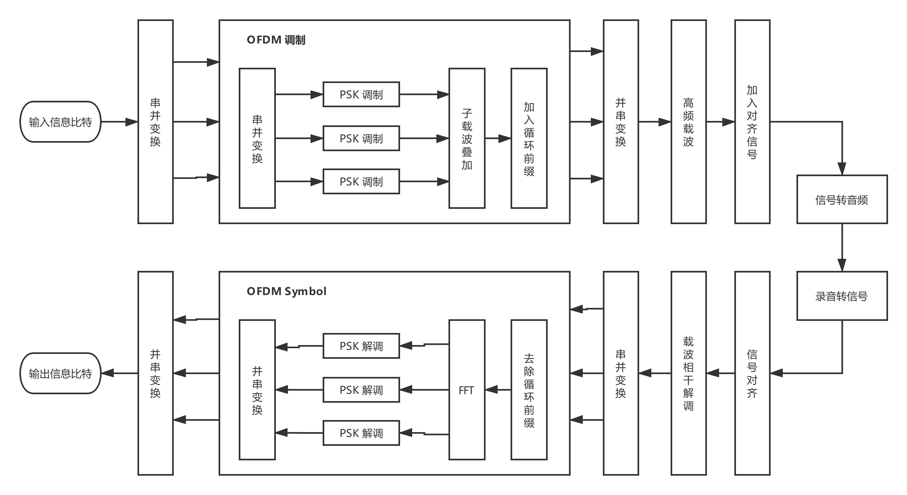
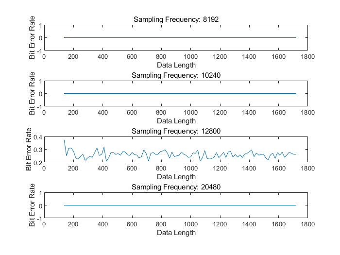
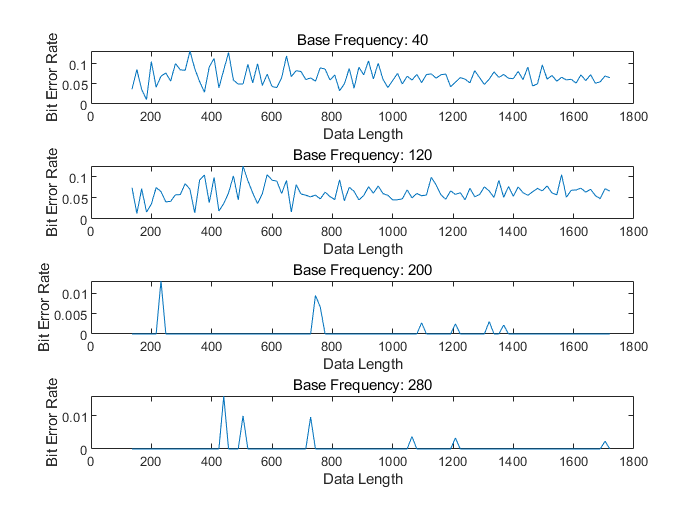

# README

> **姓名: 南亚, 周泽龙**
>
> **学号: 2016013257, 2016013231**
>
> **课程: 网络系统 (2)**
>
> **日期: 2019 年 10 月 27 日**

------
- [README](#readme)
  - [1 OFDM 原理](#1-ofdm-%e5%8e%9f%e7%90%86)
  - [2 实现方案](#2-%e5%ae%9e%e7%8e%b0%e6%96%b9%e6%a1%88)
    - [2.1 系统架构图](#21-%e7%b3%bb%e7%bb%9f%e6%9e%b6%e6%9e%84%e5%9b%be)
    - [2.2 matlab 实现](#22-matlab-%e5%ae%9e%e7%8e%b0)
      - [2.2.1 源码文件结构](#221-%e6%ba%90%e7%a0%81%e6%96%87%e4%bb%b6%e7%bb%93%e6%9e%84)
      - [2.2.2 源码导读](#222-%e6%ba%90%e7%a0%81%e5%af%bc%e8%af%bb)
    - [2.3 Android 实现](#23-android-%e5%ae%9e%e7%8e%b0)
      - [2.3.1 源码文件结构](#231-%e6%ba%90%e7%a0%81%e6%96%87%e4%bb%b6%e7%bb%93%e6%9e%84)
      - [2.3.2 源码导读](#232-%e6%ba%90%e7%a0%81%e5%af%bc%e8%af%bb)
  - [3 模拟与测试](#3-%e6%a8%a1%e6%8b%9f%e4%b8%8e%e6%b5%8b%e8%af%95)
    - [3.1 Matlab 仿真验证](#31-matlab-%e4%bb%bf%e7%9c%9f%e9%aa%8c%e8%af%81)
      - [3.1.1 BER / SNR](#311-ber--snr)
      - [3.1.2 Symbol Length / BER](#312-symbol-length--ber)
      - [3.1.3 Sampling Frequency / BER](#313-sampling-frequency--ber)
      - [3.1.4 Carrier Frequency / BER](#314-carrier-frequency--ber)
      - [3.1.5 Base Frequency / BER](#315-base-frequency--ber)
      - [3.1.6 OFDM 编码位数 / BER](#316-ofdm-%e7%bc%96%e7%a0%81%e4%bd%8d%e6%95%b0--ber)
      - [3.1.7 PSK 编码位数 / BER](#317-psk-%e7%bc%96%e7%a0%81%e4%bd%8d%e6%95%b0--ber)
    - [3.2 Android 验证](#32-android-%e9%aa%8c%e8%af%81)
      - [3.2.1 距离对传输性能的影响](#321-%e8%b7%9d%e7%a6%bb%e5%af%b9%e4%bc%a0%e8%be%93%e6%80%a7%e8%83%bd%e7%9a%84%e5%bd%b1%e5%93%8d)
      - [3.2.2 遮挡对传输性能的影响](#322-%e9%81%ae%e6%8c%a1%e5%af%b9%e4%bc%a0%e8%be%93%e6%80%a7%e8%83%bd%e7%9a%84%e5%bd%b1%e5%93%8d)
      - [3.2.3 噪声对传输性能的影响](#323-%e5%99%aa%e5%a3%b0%e5%af%b9%e4%bc%a0%e8%be%93%e6%80%a7%e8%83%bd%e7%9a%84%e5%bd%b1%e5%93%8d)
  - [4 设计特点](#4-%e8%ae%be%e8%ae%a1%e7%89%b9%e7%82%b9)

## 1 OFDM 原理

OFDM (Orthogonal Frequency Division Multiplexing) 即正交频分复用技术. O 表示正交信号波, 即不同倍数频率的正弦波. FDM 表示频分复用. 不同倍数频率的正弦余弦波的正交性, 即它们的积分为零. 在信号发射端, 利用多个正交的信号波作为子载波, 各自承载不同信息, 叠加后进行传输. 在信号接收端, 利用相应频率的积分器, 积分后解调得到相应频率的子载波所承载的信息.


​如图所示, k 个子载波调制 k 个信息, 叠加得到一个 OFDM 符号, 传输后, 经由 k 个积分器解调出 k 个信息. 当然, 可以在调制阶段引入 QSK 或者 QAM 调制. 这样单个子载波可以调制多位信息, 以此提高数据率, 缺点是导致误码率的增加, 需要把控一个平衡.

## 2 实现方案

### 2.1 系统架构图



### 2.2 matlab 实现

#### 2.2.1 源码文件结构

```text
matlab
|-- BPassFilter.m     # 滤波器
|-- Carrier.m		  # 高频载波
|-- DeCarrier.m	      # 相干解调
|-- Demodulate.m	  # 解调
|-- Modulate.m        # 调制
|-- OFDMDecode.m	  # OFDM 调制
|-- OFDMEncode.m	  # OFDM 解调
|-- PSKEncode.m		  # PSK 调制
|-- Sinc.m            # mySinc for 滤波器
```

#### 2.2.2 源码导读

> Modulate.m
> > Modulate.m 是信息调制的 `Main` 文件, 包含 encode 和 genSound 两个部分.

* encode:
  * 首先将 message 编码为比特信息
  * 然后每隔一个 OFDM 符号 (信号) 长度, 取出相应位数的比特, 进行 `OFDMEncode`, 得到一个 OFDM 符号
  * 将所有 OFDM 符号串联, 得到输出信号
  * 进行 `Carrier`,  将输出信号加到载波上, 得到新的输出信号
  * 在输出信号首尾加上 Chirp 信号, 以作解调时的对齐信号
* genSound
  * 将最终的输出信号转成音频 wav

> Demodulate.m
> > Demodulate.m 是信号解调的 `Main` 文件, 包含 anaSound 和 decode 两个部分.

* anaSound
  * 从音频文件 wav, 获取接收信号
  * 利用 `xcorr` 对齐 upChirp 和 downChirp 信号, 截取出有效信号
  * 进行 `DeCarrier` 载波相干解调
* decode
  * 每隔一个 OFDM 符号长度, 取出相应的信号
  * 使用 `BPassFilter` 滤波器滤波
  * 进行 `OFDMDecode`, 得到其调制的比特信息
  * 最后根据所有的比特信息串, 解码为 message

> OFDMEncode.m
> > OFDM 调制函数

* OFDMEncode.m 将对应位数的比特, 调制为一个 OFDM 符号
  * 首先取出相应位数的比特信息, 进行 `PSKEncode`, 得到一个正交子载波调制的 DPSK 符号
  * 将所以正交子载波叠加, 得到一个 OFDM 符号

> OFDMDecode.m
> > OFDM 解调函数

* OFDMDecode.m 将一个 OFDM 符号, 解调为相应位数的比特信息
  * 首先进行 `fft`, 得到信号频谱信息
  * 频谱的幅值数量将对应于子载波的数量
  * 由此进行 DPSK 解调, 得到每个子载波所调制的比特信息
  * 串联子载波的解调比特, 得到 OFDM 所调制的比特信息

### 2.3 Android 实现

#### 2.3.1 源码文件结构

```text
AcousticCommunication
|-- app
|	|-- java
|	|	|-- com.example.acousticcommunication
|	|	|	|-- BandPassFilter.java					# 滤波器类
|	|	|	|-- CanvasView.java						# 波形绘图类
|	|	|	|-- Demodulate.java						# 解调类
|	|	|	|-- Global.java							# 全局变量、函数
|	|	|	|-- MainActivity.java					# UI控制类
|	|	|	|-- Modulate.java						# 调制类
|-- (Other files generated by `Android Studio`)
```

#### 2.3.2 源码导读

Android 实现原理和代码结构与 Matlab 版本基本一致. 多出 UI 的控制和画布绘制波形图, 不再详细阐述.

##  3 模拟与测试

### 3.1 Matlab 仿真验证

​根据一组标准的参数设置, 每次测试改变其中一个参数, 测得误码率. 如: 在控制子载波数量, 载波频率, 基带频率, 采样频率, 符号长度不变的情况下, 测得不同信噪比下的误码率.

#### 3.1.1 BER / SNR

控制其他因素不变, 每次改变信噪比, 测得误码率. 根据以下实验结果, 可知误码率随着信噪比的增大而减小, 直至为零, 实验结果符合预期.

| PSK 编码位数 | OFDM 编码位数 | 载波频率 | 基带频率 | 采样频率 | 符号长度 | 数据长度 (bit) | 信噪比 | 误码率  |
| :----------: | :-----------: | :------: | :------: | :------: | :------: | :------------: | :----: | :-----: |
|      2       |       8       |   5000   |   400    |  40960   |   1024   |     92800      |  -10   | 0.3830  |
|      2       |       8       |   5000   |   400    |  40960   |   1024   |     92800      |   -9   | 0.3286  |
|      2       |       8       |   5000   |   400    |  40960   |   1024   |     92800      |   -8   | 0.2645  |
|      2       |       8       |   5000   |   400    |  40960   |   1024   |     92800      |   -7   | 0.1925  |
|      2       |       8       |   5000   |   400    |  40960   |   1024   |     92800      |   -6   | 0.1191  |
|      2       |       8       |   5000   |   400    |  40960   |   1024   |     92800      |   -5   | 0.0651  |
|      2       |       8       |   5000   |   400    |  40960   |   1024   |     92800      |   -4   | 0.0247  |
|      2       |       8       |   5000   |   400    |  40960   |   1024   |     92800      |   -3   | 0.0085  |
|      2       |       8       |   5000   |   400    |  40960   |   1024   |     92800      |   -2   | 0.0015  |
|      2       |       8       |   5000   |   400    |  40960   |   1024   |     92800      |   -1   | 0.00024 |
|      2       |       8       |   5000   |   400    |  40960   |   1024   |     92800      |   0    | 0.00006 |
|      2       |       8       |   5000   |   400    |  40960   |   1024   |     92800      |   1    |    0    |


#### 3.1.2 Symbol Length / BER

控制其他因素不变, 每次改变单个 OFDM 符号长度, 测得误码率. 根据以下实验结果, 可知随着 OFDM 符号长度增加, 误码率降低, 直至为 0. 实验结果符合预期, 针对不同的参数设置, 我们需要设置恰当的 OFDM 符号长度, 过短会导致误码率增加, 过长会降低数据传输效率, 得不偿失.

| PSK 编码位数 | OFDM 编码位数 | 载波频率 | 基带频率 | 采样频率 | 符号长度 | 数据长度 (bit) | 信噪比 | 误码率 |
| :----------: | :-----------: | :------: | :------: | :------: | :------: | :------------: | :----: | :----: |
|      2       |       8       |   5000   |   400    |  40960   |   512    |     92800      |   1    | 0.0382 |
|      2       |       8       |   5000   |   400    |  40960   |   1024   |     92800      |   1    |   0    |
|      2       |       8       |   5000   |   400    |  40960   |   1536   |     92800      |   1    |   0    |
|      2       |       8       |   5000   |   400    |  40960   |   2048   |     92800      |   1    |   0    |


#### 3.1.3 Sampling Frequency / BER
控制其他因素不变, 每次改变采样频率, 测得误码率. 根据以下实验结果, 观察到特殊现象, 大部分选取的采样频率下, 误码率都为零. 但是, 出现个别频率, 误码率突然大增. 经过研究, 原因大致为: 单个 OFDM 符号下各个子载波的波形, 最好为整数倍的周期, 或接近整数倍.

| PSK 编码位数 | OFDM 编码位数 | 载波频率 | 基带频率 | 采样频率 | 符号长度 | 数据长度 (bit) | 信噪比 | 误码率 |
| :----------: | :-----------: | :------: | :------: | :------: | :------: | :------------: | :----: | :----: |
|      2       |       8       |   5000   |   400    |   2560   |   1024   |     92800      |   1    | 0.2795 |
|      2       |       8       |   5000   |   400    |   4096   |   1024   |     92800      |   1    | 0.2489 |
|      2       |       8       |   5000   |   400    |   5120   |   1024   |     92800      |   1    |   0    |
|      2       |       8       |   5000   |   400    |   6400   |   1024   |     92800      |   1    | 0.2698 |
|      2       |       8       |   5000   |   400    |   8192   |   1024   |     92800      |   1    |   0    |
|      2       |       8       |   5000   |   400    |  10240   |   1024   |     92800      |   1    |   0    |
|      2       |       8       |   5000   |   400    |  12800   |   1024   |     92800      |   1    | 0.2586 |
|      2       |       8       |   5000   |   400    |  20480   |   1024   |     92800      |   1    |   0    |
|      2       |       8       |   5000   |   400    |  25600   |   1024   |     92800      |   1    |   0    |
|      2       |       8       |   5000   |   400    |  40960   |   1024   |     92800      |   1    |   0    |
|      2       |       8       |   5000   |   400    |  51200   |   1024   |     92800      |   1    | 0.0002 |
|      2       |       8       |   5000   |   400    |  81920   |   1024   |     92800      |   1    | 0.0034 |





#### 3.1.4 Carrier Frequency / BER

控制其他因素不变, 每次改变载波频率, 测得误码率. 根据以下实验结果, 观察到载波频率为 19000 和 20000 时, 误码率不为 0, 且极高. 其余载波频率对应的误码率皆为 0.

| PSK 编码位数 | OFDM 编码位数 | 载波频率 | 基带频率 | 采样频率 | 符号长度 | 数据长度 (bit) | 信噪比 | 误码率  |
| :----------: | :-----------: | :------: | :------: | :------: | :------: | :------------: | :----: | :-----: |
|      2       |       8       |   500    |   400    |  40960   |   1024   |     92800      |   1    |    0    |
|      2       |       8       |   1000   |   400    |  40960   |   1024   |     92800      |   1    |    0    |
|      2       |       8       |   5000   |   400    |  40960   |   1024   |     92800      |   1    |    0    |
|      2       |       8       |  10000   |   400    |  40960   |   1024   |     92800      |   1    |    0    |
|      2       |       8       |  15000   |   400    |  40960   |   1024   |     92800      |   1    |    0    |
|      2       |       8       |  18000   |   400    |  40960   |   1024   |     92800      |   1    | 0.00003 |
|      2       |       8       |  19000   |   400    |  40960   |   1024   |     92800      |   1    | 0.3601  |
|      2       |       8       |  20000   |   400    |  40960   |   1024   |     92800      |   1    | 0.4210  |
|      2       |       8       |  21000   |   400    |  40960   |   1024   |     92800      |   1    | 0.00005 |
|      2       |       8       |  22000   |   400    |  40960   |   1024   |     92800      |   1    |    0    |
|      2       |       8       |  25000   |   400    |  40960   |   1024   |     92800      |   1    |    0    |
|      2       |       8       |  30000   |   400    |  40960   |   1024   |     92800      |   1    |    0    |


#### 3.1.5 Base Frequency / BER

控制其他因素不变, 每次改变子载波的基频, 测得误码率. 根据以下实验结果, 可知随着子载波的基频增加, 误码率不断减小, 直至为0, 但当到达一定界限后, 误码率突然暴增. 实验结果符合预期, 前期, 随着子载波基频增加, 误码率减小至零. 当基频不断增加, 导致最高频率的子载波频率值接近 0.5 的采样频率时, 误码率突增.

| PSK 编码位数 | OFDM 编码位数 | 载波频率 | 基带频率 | 采样频率 | 符号长度 | 数据长度 (bit) | 信噪比 | 误码率  |
| :----------: | :-----------: | :------: | :------: | :------: | :------: | :------------: | :----: | :-----: |
|      2       |       8       |   5000   |    40    |  40960   |   1024   |     92800      |   1    | 0.0665  |
|      2       |       8       |   5000   |   120    |  40960   |   1024   |     92800      |   1    | 0.0638  |
|      2       |       8       |   5000   |   200    |  40960   |   1024   |     92800      |   1    | 0.00030 |
|      2       |       8       |   5000   |   280    |  40960   |   1024   |     92800      |   1    | 0.00033 |
|      2       |       8       |   5000   |   360    |  40960   |   1024   |     92800      |   1    | 0.00006 |
|      2       |       8       |   5000   |   400    |  40960   |   1024   |     92800      |   1    |    0    |
|      2       |       8       |   5000   |   2000   |  40960   |   1024   |     92800      |   1    |    0    |
|      2       |       8       |   5000   |   3800   |  40960   |   1024   |     92800      |   1    |    0    |
|      2       |       8       |   5000   |   3840   |  40960   |   1024   |     92800      |   1    |    0    |
|      2       |       8       |   5000   |   3880   |  40960   |   1024   |     92800      |   1    | 0.3816  |
|      2       |       8       |   5000   |   4000   |  40960   |   1024   |     92800      |   1    | 0.3710  |
|      2       |       8       |   5000   |   5000   |  40960   |   1024   |     92800      |   1    | 0.3754  |




#### 3.1.6 OFDM 编码位数 / BER

​控制其他因素不变, 每次改变单个 OFDM 符号编码的比特数, 测得误码率. 根据以下实验结果, 随着单个 OFDM 符号编码的比特数增加, 误码率增加.

| PSK 编码位数 | OFDM 编码位数 | 载波频率 | 基带频率 | 采样频率 | 符号长度 | 数据长度 (bit) | 信噪比 | 误码率 |
| :----------: | :-----------: | :------: | :------: | :------: | :------: | :------------: | :----: | :----: |
|      2       |       4       |   5000   |   400    |  40960   |   1024   |     46400      |   1    |   0    |
|      2       |       8       |   5000   |   400    |  40960   |   1024   |     92800      |   1    |   0    |
|      2       |      12       |   5000   |   400    |  40960   |   1024   |     139200     |   1    | 0.0006 |
|      2       |      16       |   5000   |   400    |  40960   |   1024   |     185600     |   1    | 0.0096 |
|      2       |      20       |   5000   |   400    |  40960   |   1024   |     232000     |   1    | 0.0371 |
|      2       |      24       |   5000   |   400    |  40960   |   1024   |     278400     |   1    | 0.0927 |
|      2       |      28       |   5000   |   400    |  40960   |   1024   |     324800     |   1    | 0.1589 |
|      2       |      32       |   5000   |   400    |  40960   |   1024   |     371200     |   1    | 0.2286 |


#### 3.1.7 PSK 编码位数 / BER

控制其他因素不变, 每次改变单个 DPSK 符号编码的比特数, 测得误码率. 根据以下实验结果, 随着单个 DPSK 符号编码的比特数增加, 误码率增加.

| PSK 编码位数 | OFDM 编码位数 | 载波频率 | 基带频率 | 采样频率 | 符号长度 | 数据长度 (bit) | 信噪比 | 误码率 |
| :----------: | :-----------: | :------: | :------: | :------: | :------: | :------------: | :----: | :----: |
|      2       |      16       |   5000   |   400    |  40960   |   1024   |     185600     |   1    | 0.0091 |
|      4       |      16       |   5000   |   400    |  40960   |   1024   |     185600     |   1    | 0.0142 |
|      8       |      16       |   5000   |   400    |  40960   |   1024   |     185600     |   1    | 0.2446 |
|      16      |      16       |   5000   |   400    |  40960   |   1024   |     185600     |   1    | 0.3549 |


### 3.2 Android 验证

#### 3.2.1 距离对传输性能的影响

随着距离增加, 误码率逐渐增大. 当距离超过一定范围时, 由于录音的音量迅速降低, 导致误码率快速增大. 且由于每次测试时, 环境噪声都不一致, 只能取多次测量的最优结果. 解码速度与手机性能相关, 不同手机, 解码速度不同.

| 子载波数 | 载波频率 | 基带频率 | 采样频率 | 符号长度 | 数据长度 (bit) | 距离 (cm) | 误码率 | 解码速度 (bit/s) |
| :------: | :------: | :------: | :------: | :------: | :------------: | :-------: | :----: | ---------------- |
|    4     |   5000   |   400    |  40960   |   2048   |      184       |    10     | 0.0109 | 17.0460          |
|    4     |   5000   |   400    |  40960   |   2048   |      184       |    20     | 0.0271 | 16.8281          |
|    4     |   5000   |   400    |  40960   |   2048   |      184       |    30     | 0.0217 | 15.6535          |
|    4     |   5000   |   400    |  40960   |   2048   |      184       |    40     | 0.0217 | 16.7352          |
|    4     |   5000   |   400    |  40960   |   2048   |      184       |    60     | 0.0707 | 15.5638          |
|    4     |   5000   |   400    |  40960   |   2048   |      184       |    80     | 0.1141 | 15.2208          |

#### 3.2.2 遮挡对传输性能的影响

不同遮挡物, 导致不同的误码率. 遮挡物越厚, 误码率越高.

| 子载波数 | 载波频率 | 基带频率 | 采样频率 | 符号长度 | 数据长度(bit) | 距离 (cm) | 遮挡物品 | 误码率 | 解码速度 (bit/s) |
| :------: | :------: | :------: | :------: | :------: | :-----------: | :-------: | -------- | :----: | ---------------- |
|    4     |   5000   |   400    |  40960   |   2048   |      184      |    30     | 无       | 0.0217 | 15.6535          |
|    4     |   5000   |   400    |  40960   |   2048   |      184      |    30     | A4纸     | 0.0326 | 15.8929          |
|    4     |   5000   |   400    |  40960   |   2048   |      184      |    30     | 鼠标垫   | 0.0815 | 15.2803          |
|    4     |   5000   |   400    |  40960   |   2048   |      184      |    30     | 键盘     | 0.1141 | 14.7418          |

#### 3.2.3 噪声对传输性能的影响

播放音乐时的误码率. 随着电脑音量的增加, 误码率增加. 当音乐音量过大时, 误码率突增.

| 子载波数 | 载波频率 | 基带频率 | 采样频率 | 符号长度 | 数据长度(bit) | 距离 (cm) | 音乐音量 | 误码率 | 解码速度 (bit/s) |
| :------: | :------: | :------: | :------: | :------: | :-----------: | :-------: | -------- | :----: | ---------------- |
|    4     |   5000   |   400    |  40960   |   2048   |      184      |    30     | 10       | 0.0054 | 16.5566          |
|    4     |   5000   |   400    |  40960   |   2048   |      184      |    30     | 20       | 0.0380 | 15.9733          |
|    4     |   5000   |   400    |  40960   |   2048   |      184      |    30     | 30       | 0.1685 | 13.6315          |


## 4 设计特点

1. 针对每个 OFDM 符号调制, 引入 DPSK (差分相移键控) 调制子载波  , 提高单个 OFDM 符号所调制的比特信息
   * 前后相邻码元的相对相位值来调制信息
   * 克服 PSK 的相位模糊现象
2. 在每个 OFDM 符号前添加循环前缀, 减小误码率
3. 信号对齐, 一开始采用的方案是利用一个 upChirp 信号找到信号起始位置, 然后在数据包头传输了信号的比特位数, 即信号长度. 以此截取有效信号. 但是由于解码信号长度时可能误码, 即使一个比特解码错误, 都是不能承受的. 因此, 最后采取 upChirp 信号和 downChirp 信号来对齐信号起始点和结束点
4. 得到 OFDM 信号后, 将其加载到高频载波上, 以此减少噪声干扰

