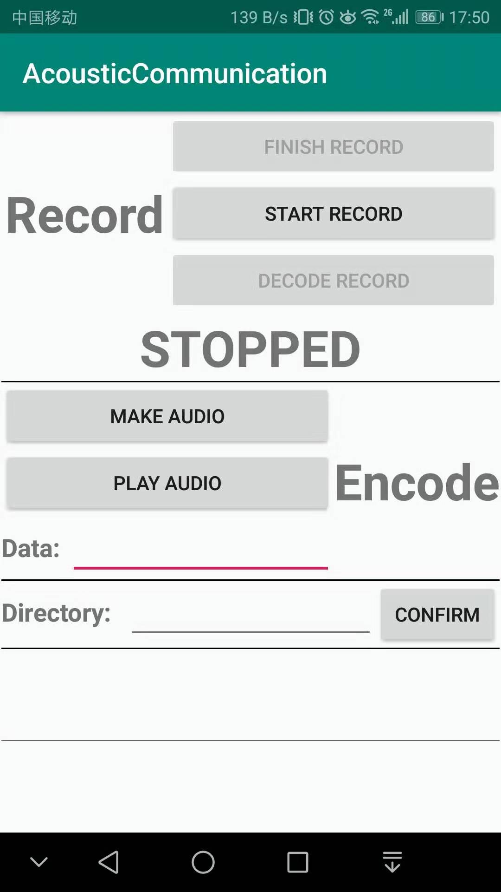
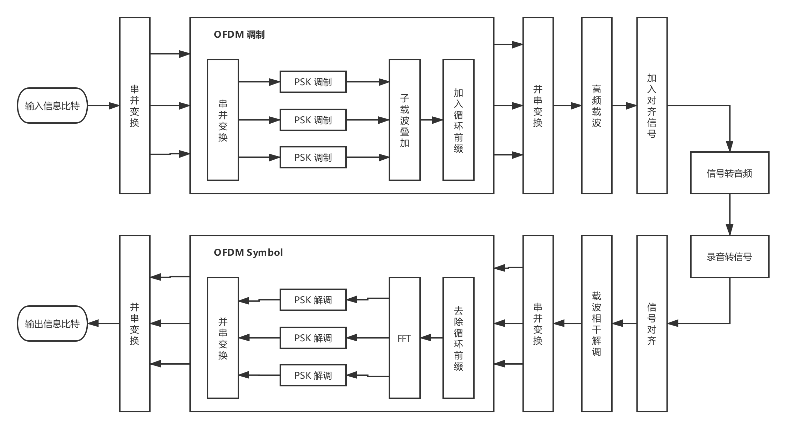

# README

------
- [README](#readme)
  - [1 运行说明](#1-%e8%bf%90%e8%a1%8c%e8%af%b4%e6%98%8e)
    - [1.1 MatLab](#11-matlab)
    - [1.2 Android](#12-android)
  - [2 实现方案](#2-%e5%ae%9e%e7%8e%b0%e6%96%b9%e6%a1%88)
    - [2.1 系统架构图](#21-%e7%b3%bb%e7%bb%9f%e6%9e%b6%e6%9e%84%e5%9b%be)
    - [2.2 MatLab 实现](#22-matlab-%e5%ae%9e%e7%8e%b0)
      - [2.2.1 源码文件结构](#221-%e6%ba%90%e7%a0%81%e6%96%87%e4%bb%b6%e7%bb%93%e6%9e%84)
      - [2.2.2 源码导读](#222-%e6%ba%90%e7%a0%81%e5%af%bc%e8%af%bb)
    - [2.3 Android 实现](#23-android-%e5%ae%9e%e7%8e%b0)
      - [2.3.1 源码文件结构](#231-%e6%ba%90%e7%a0%81%e6%96%87%e4%bb%b6%e7%bb%93%e6%9e%84)
      - [2.3.2 源码导读](#232-%e6%ba%90%e7%a0%81%e5%af%bc%e8%af%bb)
  - [3 设计特点](#3-%e8%ae%be%e8%ae%a1%e7%89%b9%e7%82%b9)

## 1 运行说明

### 1.1 MatLab

* 直接运行 Modulate.m, 调制
  * 它会根据代码中的 message 生成输出信号和音频 output.wav
* 运行 Demodulate.m, 解调有两种模式
  * 输入1, 选择模式一: 加入高斯噪声直接解调 output.wav, 得到 message
  * 输入2, 选择模式二: 需要手机或者其他录音设备, 播放 output.wav, 然后录音, 得到 received.wav, 然后解调 received.wav, 得到message

### 1.2 Android


* 安卓应用使用说明
  * 首先需要在 Directory 文本框内手动输入音频文件存储目录, 如 :"storage/emulated/0/recorder"
  * 输入要传输的信息 Data
  * 点击 "MAKE AUDIO", 生成 output.wav
  * 点击 "START RECORD", 进行录音
  * 点击 "FINISH RECORD", 结束录音, 得到 received.wav
  * 点击 "DECODE RECORD", 开始解码, 得到 Data
  * 可以使用单个手机一边录音一边放音, 也可使用双手机.


## 2 实现方案

### 2.1 系统架构图



### 2.2 MatLab 实现

#### 2.2.1 源码文件结构

```python
matlab
|-- BPassFilter.m     # 滤波器
|-- Carrier.m		  # 高频载波
|-- DeCarrier.m	      # 相干解调
|-- Demodulate.m	  # 解调
|-- Modulate.m        # 调制
|-- OFDMDecode.m	  # OFDM 调制
|-- OFDMEncode.m	  # OFDM 解调
|-- PSKEncode.m		  # PSK 调制
|-- Sinc.m            # mySinc for 滤波器
```

#### 2.2.2 源码导读

> Modulate.m
> > Modulate.m 是信息调制的 `Main` 文件, 包含 encode 和 genSound 两个部分.

* encode:
  * 首先将 message 编码为比特信息
  * 然后每隔一个 OFDM 符号 (信号) 长度, 取出相应位数的比特, 进行 `OFDMEncode`, 得到一个 OFDM 符号
  * 将所有 OFDM 符号串联, 得到输出信号
  * 进行 `Carrier`,  将输出信号加到载波上, 得到新的输出信号
  * 在输出信号首尾加上 Chirp 信号, 以作解调时的对齐信号
* genSound
  * 将最终的输出信号转成音频 wav


> Demodulate.m
> > Demodulate.m 是信号解调的 `Main` 文件, 包含 anaSound 和 decode 两个部分.

* anaSound
  * 从音频文件 wav, 获取接收信号
  * 利用 `xcorr` 对齐 upChirp 和 downChirp 信号, 截取出有效信号
  * 进行 `DeCarrier` 载波相干解调
* decode
  * 每隔一个 OFDM 符号长度, 取出相应的信号
  * 使用 `BPassFilter` 滤波器滤波
  * 进行 `OFDMDecode`, 得到其调制的比特信息
  * 最后根据所有的比特信息串, 解码为 message


> OFDMEncode.m
> > OFDM 调制函数

* OFDMEncode.m 将对应位数的比特, 调制为一个 OFDM 符号
  * 首先取出相应位数的比特信息, 进行 `PSKEncode`, 得到一个正交子载波调制的 DPSK 符号
  * 将所以正交子载波叠加, 得到一个 OFDM 符号


> OFDMDecode.m
> > OFDM 解调函数

* OFDMDecode.m 将一个 OFDM 符号, 解调为相应位数的比特信息
  * 首先进行 `fft`, 得到信号频谱信息
  * 频谱的幅值数量将对应于子载波的数量
  * 由此进行 DPSK 解调, 得到每个子载波所调制的比特信息
  * 串联子载波的解调比特, 得到 OFDM 所调制的比特信息


### 2.3 Android 实现

#### 2.3.1 源码文件结构

```python
AcousticCommunication
|-- app
|	|-- java
|	|	|-- com.example.acousticcommunication
|	|	|	|-- BandPassFilter.java               # 滤波器类
|	|	|	|-- CanvasView.java                   # 波形绘图类
|	|	|	|-- Demodulate.java                   # 解调类
|	|	|	|-- Global.java                       # 全局变量、函数
|	|	|	|-- MainActivity.java                 # UI控制类
|	|	|	|-- Modulate.java                     # 调制类
|-- (Other files generated by `Android Studio`)
```

#### 2.3.2 源码导读

Android 实现原理和代码结构与 MatLab 版本基本一致. 多出 UI 的控制和画布绘制波形图. 不再详细阐述.


## 3 设计特点

1. 针对每个 OFDM 符号调制, 引入 DPSK (差分相移键控) 调制子载波, 提高单个 OFDM 符号所调制的比特信息
   * 前后相邻码元的相对相位值来调制信息
   * 克服 PSK 的相位模糊现象
2. 在每个 OFDM 符号前添加循环前缀, 减小误码率
3. 信号对齐, 一开始采用的方案是利用一个 upChirp 信号找到信号起始位置, 然后在数据包头传输了信号的比特位数, 即信号长度. 以此截取有效信号. 但是由于解码信号长度时可能误码, 即使一个比特解码错误, 都是不能承受的. 因此, 最后采取 upChirp 信号和 downChirp 信号来对齐信号起始点和结束点
4. 得到 OFDM 信号后, 将其加载到高频载波上, 以此减少噪声干扰
